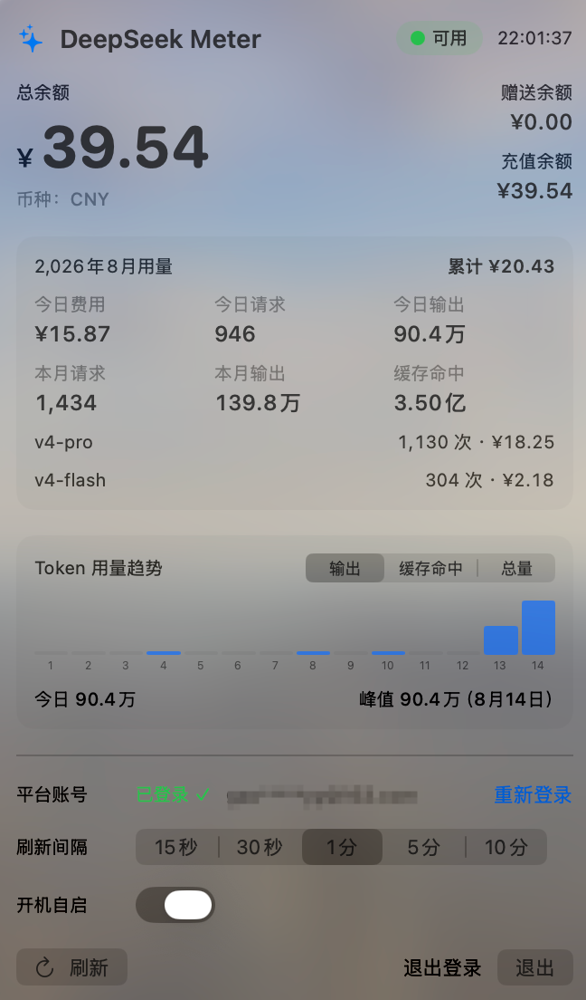
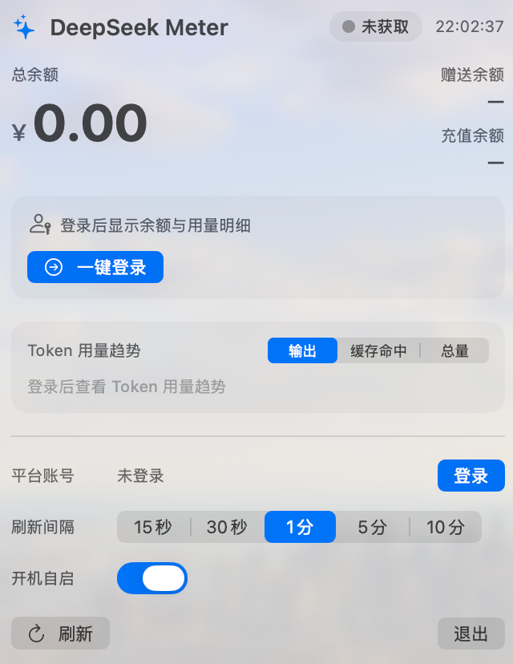

# DeepSeekMeter 🐳

[](https://github.com/pppolf/DeepSeekMeter/releases)
[](LICENSE)
[](https://github.com/pppolf/DeepSeekMeter/actions/workflows/ci.yml)


[English](README.md)

一个轻量的 **macOS 菜单栏小工具**：实时查看 DeepSeek 账户的余额、消费和 Token 用量。点击菜单栏图标弹出悬浮窗，数据一目了然。同时提供**功能对齐的 Windows 版**（系统托盘），代码在 [`windows/`](windows/README.md)。

## ✨ 功能

- 🖥️ **菜单栏余额**：菜单栏直接显示当前余额；低于 10 变橙色、低于 1 变红色
- 🔑 **一键登录**：内嵌官方登录页，登录一次即可自动获取并保存登录态，全程不用开发者工具
- 📊 **用量明细**：本月/今日费用、请求数、输出 Token、缓存命中，按模型拆分
- 📈 **Token 用量趋势**：本月按天的 Token 用量柱状图（输出 / 缓存命中 / 总量可切换）
- ⏱️ **定时刷新**：15 秒 ~ 10 分钟可选
- 🚀 **开机自启**

## 📸 截图

| 已登录：余额、用量明细与 Token 趋势 | 未登录：一键登录引导 |
| :---: | :---: |
|  |  |

## 📋 环境要求

- **macOS**：macOS 14+（Apple Silicon / Intel 均可）；Xcode Command Line Tools（`xcode-select --install`）——仅源码构建需要
- **Windows**：Windows 10（1809+）/ 11；从 Release 下载 ZIP 无需安装任何东西（自包含版本已打包 .NET 运行时，WebView2 Runtime 随系统预装）；仅源码构建需要 [.NET 8 SDK](https://dotnet.microsoft.com/download/dotnet/8.0)

## ⬇️ 安装

### 从 Release 下载（推荐）

1. 在 [Releases 页面](https://github.com/pppolf/DeepSeekMeter/releases) 下载最新的 `DeepSeekMeter-<版本>-macOS.dmg`
2. 打开 DMG，把 `DeepSeekMeter.app` **拖到 `Applications` 快捷方式上**
3. 首次启动：右键 App → **打开**（App 为 ad-hoc 签名，Gatekeeper 会询问一次；或用 `xattr -dr com.apple.quarantine /Applications/DeepSeekMeter.app` 解除）

> **为什么提示「Apple 无法验证」？** 因为 App 目前是免费的 ad-hoc 签名（没有付费 Apple 开发者账号），下载副本会被 Gatekeeper 拦截。彻底消除需要**付费的 Apple Developer Program**：用你的 **Developer ID 证书**签名并公证：

> ```bash
> APPLE_ID=you@example.com \
> APP_PASSWORD=xxxx-xxxx-xxxx-xxxx \
> TEAM_ID=ABCDE12345 \
> ./Scripts/notarize.sh build/DeepSeekMeter.app
> ```
>
> （APP_PASSWORD 是 appleid.apple.com 生成的「App 专用密码」；build-app.sh 检测到开发者证书时会自动改用 Developer ID 签名。）

### 从源码构建

```bash
swift run                       # 开发模式直接跑
./Scripts/build-app.sh          # 构建 build/DeepSeekMeter.app
./Scripts/install.sh            # 构建 + 安装到 /Applications 并启动
```

### Windows 下载（推荐）

1. 在 [Releases 页面](https://github.com/pppolf/DeepSeekMeter/releases) 下载 `DeepSeekMeter-win-x64.zip`
2. 解压到任意目录，双击 `DeepSeekMeter.exe` 运行（无需安装 .NET SDK）

### Windows 从源码构建

```powershell
dotnet build windows/DeepSeekMeter.sln -c Release
dotnet run --project windows/src/DeepSeekMeter -c Release
```

发布自包含 ZIP：

```powershell
pwsh Scripts/publish-windows.ps1    # 生成 windows/publish/DeepSeekMeter-win-x64.zip
```

详见 [windows/README.md](windows/README.md)。

## 🚀 快速开始

1. 启动应用，菜单栏出现 🐳 图标
2. 点击图标 → 点「**登录**」
3. 在内嵌的官方页面（[platform.deepseek.com](https://platform.deepseek.com)）登录（密码或扫码）
4. 完成！悬浮窗立即显示余额和本月用量

> 登录态 Token 保存在本机 App 偏好文件中；过期后悬浮窗会提示「登录已过期」，点「重新登录」一键恢复。

## 🔒 隐私与数据

- 所有数据均来自 DeepSeek 官方平台接口（`get_user_summary` / `usage/by_api_key/amount` / `usage/by_api_key/cost`），使用**你自己的登录态**获取，不会发送到任何第三方
- Token 只保存在本机 `~/Library/Preferences/com.deepseek.meter.plist`；悬浮窗「退出登录」可随时清除
- 用量/费用统计**非实时**：当日数据可能延迟数小时甚至次日才更新（余额为实时扣减）

## 🛠 开发

```
Sources/DeepSeekMeter/           App 源码（SwiftUI + AppKit）
  Views/                         悬浮窗 UI
  LoginWindowController.swift    内嵌登录页 + Token 自动提取
  PlatformService.swift          平台接口客户端
Scripts/                         构建 / 安装 / 图标 / 自测脚本
Scripts/selftest/                轻量单元测试（无需 Xcode）
windows/                         Windows 版（.NET 8 + WPF，详见 windows/README.md）
```

```bash
./Scripts/run-tests.sh           # 运行 macOS 自测
dotnet run --project windows/tests/DeepSeekMeter.Selftest -c Release   # 运行 Windows 自测
```

## ❓ 常见问题

- **Token 过期了？** 悬浮窗点「重新登录」，一键重登即可。
- **菜单栏没有图标？** 检查「活动监视器」里是否有 `DeepSeekMeter` 进程，或重新 `./Scripts/install.sh`。
- **如何退出？** 菜单栏图标 → 悬浮窗「退出」。
- **如何卸载？** 删除 `/Applications/DeepSeekMeter.app` 和 `~/Library/Preferences/com.deepseek.meter.plist`。

## 🤝 贡献

欢迎贡献！请先阅读 [CONTRIBUTING.zh-CN.md](CONTRIBUTING.zh-CN.md)（英文版见 [CONTRIBUTING.md](CONTRIBUTING.md)）——包含构建/测试命令、代码与提交规范，以及项目边界。使用 AI 编码助手时，它会遵循仓库根目录 [AGENTS.md](AGENTS.md) 的操作规范。

## 📄 开源协议

[MIT](LICENSE) © 2026 pppolf