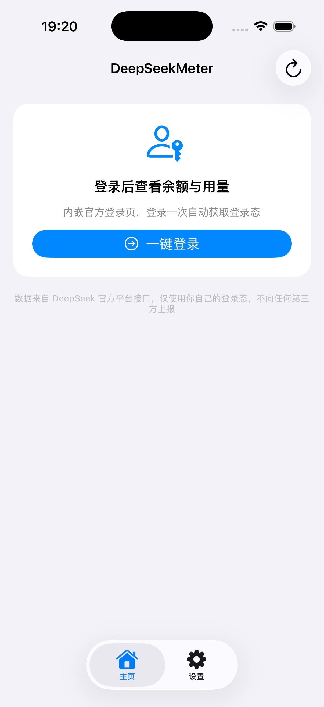

# DeepSeekMeter 🐳

[English](README.md)

DeepSeekMeter 是一个轻量、注重隐私的账户监视工具，覆盖 **macOS、Windows、Android**，并在同一仓库提供**开发中的 iOS 源码实现**。它展示 DeepSeek 余额、消费、请求/Token 用量和按天趋势，不把数据发送给任何第三方。

当前最新稳定版本是 **[v0.3.1](https://github.com/pppolf/DeepSeekMeter/releases/tag/v0.3.1)**。macOS、Windows 和 Android 发布产物由 GitHub Actions 根据版本标签构建；iOS 目前只提供源码，TestFlight/App Store 分发等待 Apple Developer 账号。

## 平台状态与下载

| 平台 | 当前状态 | 最新发布 / 运行方式 |
| :--- | :--- | :--- |
| macOS | 稳定版菜单栏 App | [DeepSeekMeter-0.3.1-macOS.dmg](https://github.com/pppolf/DeepSeekMeter/releases/tag/v0.3.1) |
| Windows | 稳定版系统托盘 App | [DeepSeekMeter-win-x64.zip](https://github.com/pppolf/DeepSeekMeter/releases/tag/v0.3.1) |
| Android | A4 已完成；提供直装 APK | [DeepSeekMeter-v0.3.1-android.apk](https://github.com/pppolf/DeepSeekMeter/releases/tag/v0.3.1) |
| iOS | M1–M5 源码实现完成，尚未公开分发 | 从 [ios/](ios/README.zh-CN.md) 源码构建 |

## 功能

### 共通能力

- 展示余额和钱包币种
- 内嵌 DeepSeek 官方登录页，自动提取登录态 Token；支持的平台提供手动粘贴兜底
- 本月/今日费用、请求数、输出 Token、缓存命中 Token 和按模型拆分
- 本月按天 Token 趋势（输出 / 缓存命中 / 总量）
- 桌面端和移动端前台页面支持 15 秒至 10 分钟的刷新间隔
- 数据只在本机与 DeepSeek 官方接口之间流转，无统计 SDK、代理或第三方上报

### 平台能力

- **macOS**：菜单栏余额、悬浮窗、开机自启
- **Windows**：系统托盘余额颜色、WebView2 登录、当前用户开机自启
- **Android**：跟随生命周期的前台轮询、WorkManager 尽力而为后台刷新、余额低阈值本地通知
- **iOS**：SwiftUI App、Keychain Token 存储、前后台刷新、余额低阈值本地通知、快照驱动的 WidgetKit 余额小组件

## 截图

| macOS — 已登录 | macOS — 登录提示 | iOS 模拟器 |
| :---: | :---: | :---: |
|  |  |  |

## 环境要求

| 平台 | 普通用户 | 源码构建 |
| :--- | :--- | :--- |
| macOS | macOS 14+，Apple Silicon 或 Intel | Xcode Command Line Tools；macOS target 不要求完整 Xcode |
| Windows | Windows 10 1809+ / Windows 11；Release ZIP 自包含 | .NET 8 SDK；内嵌登录页通常可使用 WebView2 Runtime，若初始化失败可安装 Runtime 或使用手动 Token 兜底 |
| Android | Android 8.0 / API 26+；Release APK 可直装 | JDK 17、Android SDK platform 35；仓库 wrapper 会自动下载 Gradle 8.14.2 |
| iOS | 暂无公开二进制包 | Xcode 16+、iOS 17 部署目标；真机分发需要 Apple Developer 签名 |

## 安装与运行

### macOS

1. 在 [Releases 页面](https://github.com/pppolf/DeepSeekMeter/releases) 下载最新 DeepSeekMeter-<版本>-macOS.dmg。
2. 打开 DMG，将 DeepSeekMeter.app 拖到 Applications 快捷方式上。
3. 首次启动时右键 App → **打开**。Release 使用 ad-hoc 签名，Gatekeeper 会询问一次；要面向普通用户消除提示，需要 Developer ID 签名并完成公证。
4. 点击菜单栏鲸鱼图标，选择「登录」。

### Windows

1. 在 [Releases 页面](https://github.com/pppolf/DeepSeekMeter/releases) 下载 DeepSeekMeter-win-x64.zip。
2. 解压后运行 DeepSeekMeter.exe；自包含 Release 不需要 .NET SDK。
3. 如果内嵌 WebView2 登录不可用，可使用内置「手动粘贴 Token」兜底。

详见 [Windows 使用与构建说明](windows/README.zh-CN.md)。

### Android

1. 在 [v0.3.1 Release](https://github.com/pppolf/DeepSeekMeter/releases/tag/v0.3.1) 下载 DeepSeekMeter-v0.3.1-android.apk。
2. 以侧载 APK 方式安装；Android 可能要求允许打开该文件的应用安装未知来源应用。
3. APK 使用 debug 签名，便于直装，不代表 Play 商店发布或发布者身份认证。

详见 [Android 使用与构建说明](android/README.zh-CN.md)。

### iOS

iOS 暂无公开二进制包。打开 [ios/](ios/README.zh-CN.md) 下的 Xcode 工程，选择模拟器或配置签名 Team 后运行。TestFlight/App Store 分发属于后续工作。

## 从源码构建

以下命令均在仓库根目录执行：

~~~bash
# macOS
swift build
swift build -c release
bash Scripts/run-tests.sh
bash Scripts/build-app.sh release

# Windows（PowerShell）
dotnet build windows/DeepSeekMeter.sln -c Release
dotnet run --project windows/src/DeepSeekMeter -c Release
pwsh Scripts/publish-windows.ps1

# Android
cd android
./gradlew :core:test :app:assembleDebug
./gradlew :app:assembleRelease
cd ..

# iOS 核心与工程校验（核心校验不要求 Xcode）
bash Scripts/run-ios-tests.sh
# 模拟器构建/安装/运行，需要 Xcode 和 iOS 运行时
bash Scripts/run-ios-simulator.sh
~~~

平台专项说明：[Windows](windows/README.zh-CN.md)、[iOS](ios/README.zh-CN.md)、[Android](android/README.zh-CN.md)。

## 快速开始

启动桌面或移动端版本后：

1. 打开 App，选择「登录」。
2. 在官方 platform.deepseek.com 页面使用密码或扫码登录。
3. 回到 App，余额和当前用量快照会自动加载。
4. 如果登录态过期，选择「重新登录」；退出登录会清除本机保存的 Token。

## 隐私与数据

- 请求由 App 直接发往 DeepSeek 私有平台接口：/auth-api/v0/users/current、/api/v0/users/get_user_summary、/api/v0/usage/by_api_key/amount、/api/v0/usage/by_api_key/cost。这些不是公开 API 契约，平台聚合本身可能存在统计延迟。
- App 不会把 Token、余额、用量、遥测或分析数据发送给本项目维护者或任何其他第三方。
- Token 按平台存储：macOS UserDefaults（路径为 ~/Library/Preferences/com.deepseek.meter.plist）、Windows DPAPI 保护的设置、iOS Keychain、Android Keystore 加密后写入 SharedPreferences 的密文。
- iOS 小组件只从 App Group 读取非敏感余额快照；Android 后台任务不会通过 WorkManager 输入数据接收 Token。
- 不要把真实 Token 粘贴到源码、Issue、日志或截图中。

## 仓库结构

~~~text
Sources/DeepSeekMeter/       macOS SwiftUI + AppKit 菜单栏 App
windows/                     .NET 8 + WPF 系统托盘实现
  README.md                  Windows 英文说明
  README.zh-CN.md            Windows 中文说明
ios/                         iOS SwiftUI App、WidgetKit 扩展与共享核心
android/                     Android Compose App 与零 AndroidX 核心模块
Scripts/                     构建、打包、自测与移动端校验脚本
MOBILE-PLAN.md               移动端里程碑、决策与边界规则
.github/workflows/            macOS/Windows/iOS/Android CI 与标签发布流水线
~~~

## 测试与 CI

~~~bash
# macOS
bash Scripts/run-tests.sh

# Windows
dotnet run --project windows/tests/DeepSeekMeter.Selftest -c Release

# iOS 核心、漂移与工程校验
bash Scripts/run-ios-tests.sh

# Android JVM 单测与 debug App 构建
cd android && ./gradlew :core:test :app:assembleDebug
~~~

每个 Pull Request 和 main push 都会运行平台 CI。推送 v* 标签会启动发布流水线，构建 macOS DMG、Windows 自包含 ZIP 和 Android APK，并附加到 GitHub Release。iOS 模拟器产物会在 CI 中校验，但暂不作为用户下载包发布。

## 常见问题

- **Token 过期了。** 点「重新登录」，App 会通过官方页面重新认证。
- **桌面图标不见了。** 检查进程是否运行，再按对应平台的安装说明重装；macOS 是纯菜单栏 App，不会显示 Dock 图标。
- **Android 没有通知。** 在系统设置中允许 App 通知；后台投递受 WorkManager 和系统调度影响，属于尽力而为。
- **如何卸载？** 删除 App 及本机数据：macOS 的 ~/Library/Preferences/com.deepseek.meter.plist、Windows 的 %APPDATA%/DeepSeekMeter 与 %LOCALAPPDATA%/DeepSeekMeter，或清除/卸载 Android App 数据；iOS 删除 App 即可。
- **iOS 为什么没有 TestFlight？** 源码实现已就绪，但签名与分发仍需要 Apple Developer Program 账号。

## 贡献

欢迎贡献。请先阅读 [CONTRIBUTING.md](CONTRIBUTING.md)，中文版见 [CONTRIBUTING.zh-CN.md](CONTRIBUTING.zh-CN.md)，其中包含构建/测试命令、提交规范和项目边界。AI 编码助手还应遵循 [AGENTS.md](AGENTS.md)。

## 开源协议

[MIT](LICENSE) © 2026 pppolf
